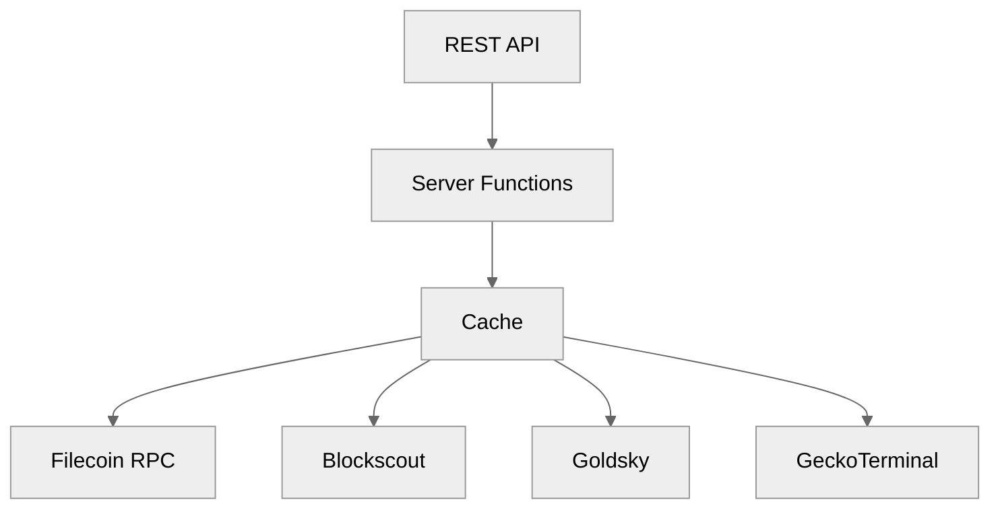
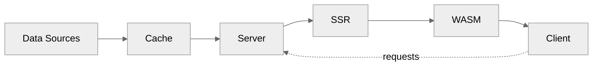

# USDFC Analytics Terminal

Real-time analytics for USDFC stablecoin on Filecoin. Unified REST API aggregating 4 data sources into 10 developer-friendly endpoints.

## Problem
USDFC data is fragmented across Filecoin RPC, Blockscout, Secured Finance subgraph, and GeckoTerminal—each with different auth, rate limits, and formats.

## Solution
Single REST API with caching, consistent JSON responses, and <100ms latency.

## Features
- **Protocol Metrics** - TCR, supply, collateral, stability pool
- **Price & Volume** - Real-time from DEX pools
- **Trove Explorer** - All positions with ICR health
- **Lending Markets** - Secured Finance rates
- **Transaction History** - Recent USDFC transfers
- **Address Lookup** - Full balance sheet per address

## Quick Start
```bash
# Prerequisites: Rust 1.75+, cargo-leptos
git clone https://github.com/symulacr/usdfc-terminal.git
cd usdfc-terminal
cp .env.example .env
cargo leptos build --release
./target/release/usdfc-analytics-terminal
```

## API Usage
```bash
# Get price
curl http://localhost:3000/api/v1/price

# Get protocol metrics
curl http://localhost:3000/api/v1/metrics

# Get troves
curl http://localhost:3000/api/v1/troves?limit=50
```

See [API.md](./API.md) for all 10 endpoints.

## Screenshots
<!-- Add after deployment -->
| Dashboard | Protocol | Lending |
|-----------|----------|---------|
|  |  |  |

## Architecture



## Data Flow



## API Endpoints

```
/api/v1
├── health          service status
├── price           usdfc/fil prices
├── metrics         protocol tcr, supply
├── troves          cdp positions
├── troves/:addr    single trove
├── holders         top holders
├── transactions    recent transfers
├── address/:addr   wallet lookup
├── lending         secured finance rates
└── history         7-day snapshots
```

## Tech Stack
- **Leptos 0.6** - Full-stack Rust (SSR + WASM)
- **Axum** - HTTP server with security headers
- **SQLite** - Metrics persistence (7-day history)
- **Tokio** - Async runtime

## Performance
- SSR render: <5ms
- API response: <100ms (p99)
- Cache hit: >90%

## Documentation
- [API Reference](./API.md)
- [Installation](./INSTALL.md)
- [Environment Variables](./.env.example)

## License
MIT + Apache 2.0 dual license. See [LICENSE](./LICENSE).

## Contributing
Issues and PRs welcome. See [CONTRIBUTING.md](./CONTRIBUTING.md).

---

Built for Filecoin ecosystem. Data sources: Filecoin RPC, Blockscout, Secured Finance, GeckoTerminal.
