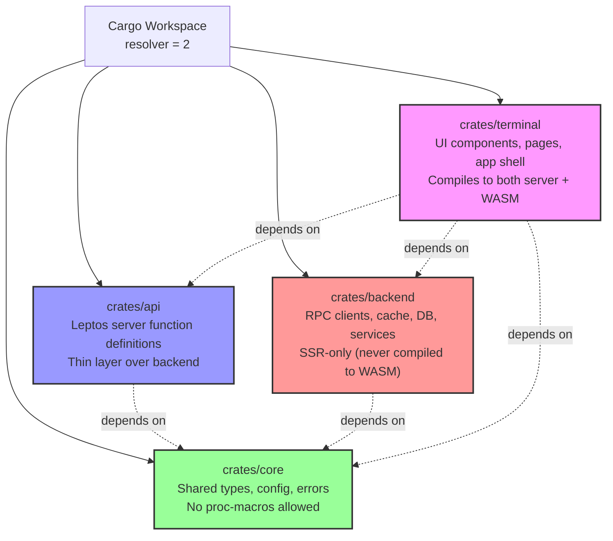
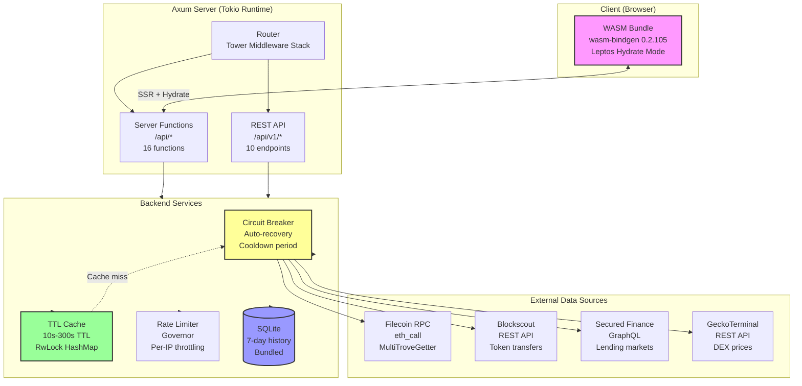
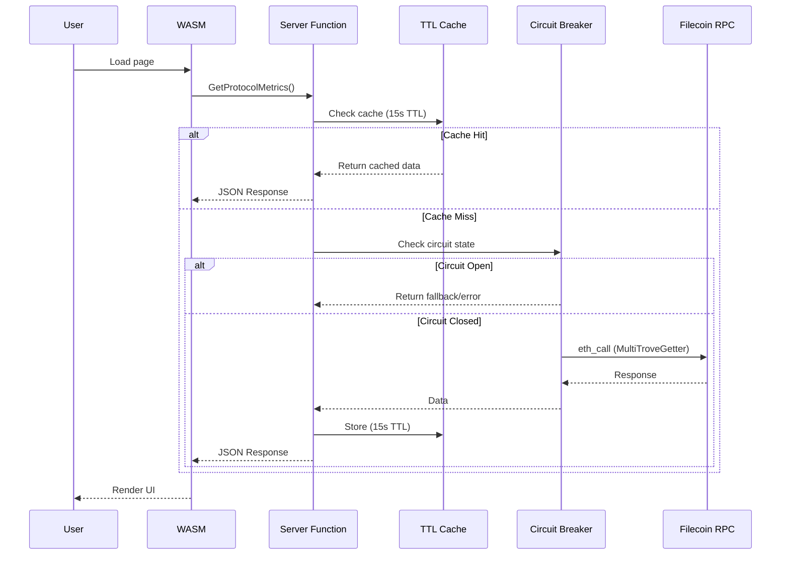

# USDFC Analytics Terminal - Architecture

Complete system architecture, data flow, and technical implementation details.

---

## Table of Contents

1. [Overview](#overview)
2. [Cargo Workspace Structure](#cargo-workspace-structure)
3. [System Architecture](#system-architecture)
4. [Data Flow & Caching Strategy](#data-flow--caching-strategy)
5. [API Architecture](#api-architecture)
6. [Complete Tech Stack](#complete-tech-stack)
7. [Build Profiles](#build-profiles)
8. [Deployment Flow](#deployment-flow)

---

## Overview

The USDFC Analytics Terminal is built as a 4-crate Cargo workspace using Leptos 0.6 for full-stack Rust development. The architecture supports:

- **Server-Side Rendering (SSR)** for fast initial page loads and SEO
- **WASM Hydration** for interactive client-side updates
- **Dual API exposure** (REST endpoints + Leptos server functions)
- **Resilient external API integration** (circuit breaker, caching, rate limiting)

**Key Metrics:**
- 16 Leptos server functions
- 10 REST API endpoints
- 4 external data sources
- <100ms API response time (p99)
- 0.58 GB RAM, 0.03 vCPU on Railway

---

## Cargo Workspace Structure



### Crate Responsibilities

#### `crates/core` - Shared Types
**Purpose:** Lightweight shared types, configuration, and errors

**Key Files:**
- `types.rs` - All API types (ProtocolMetrics, Trove, Transaction, etc.)
- `config.rs` - Environment-based configuration
- `error.rs` - ApiError and ApiResult types
- `format.rs` - Display formatting utilities

**Dependencies:** Minimal (serde, rust_decimal, chrono, thiserror, once_cell, dotenvy)

**Design Principle:** No proc-macros allowed to keep compilation fast

---

#### `crates/api` - Server Function Layer
**Purpose:** Leptos server function definitions (callable from WASM)

**Key Files:**
- `lib.rs` - 16 server function definitions using `#[server]` macro

**Server Functions:**
1. GetProtocolMetrics
2. GetRecentTransactions
3. GetTroves
4. GetLendingMarkets
5. GetDailyVolumes
6. GetAddressInfo
7. GetNormalizedAddress
8. GetTopHolders
9. GetStabilityPoolTransfers
10. GetUSDFCPriceData
11. CheckApiHealth
12. GetHolderCount
13. GetOrderBook
14. GetRecentLendingTrades
15. GetAdvancedChartData
16. GetWalletAnalytics

**Compilation:**
- With `ssr` feature: Calls backend services
- Without `ssr` feature: Returns empty/default data

---

#### `crates/backend` - Service Layer
**Purpose:** SSR-only backend services (RPC clients, caching, database)

**Modules:**
- `rpc.rs` - Filecoin RPC client (eth_call, MultiTroveGetter)
- `blockscout.rs` - Blockscout REST API client
- `subgraph.rs` - Secured Finance GraphQL client
- `gecko.rs` - GeckoTerminal REST API client
- `cache.rs` - Custom TTL cache implementation
- `circuit_breaker.rs` - Circuit breaker pattern for resilience
- `historical.rs` - SQLite database for 7-day metrics history
- `server_fn.rs` - Server function implementations
- `address_conv.rs` - Filecoin address conversion (0x ↔ f4)
- `state.rs` - Application state (Leptos options)
- `fileserv.rs` - Static file serving
- `api/` - REST API handlers (10 endpoints)

**Note:** Never compiled to WASM, only used in server binary

---

#### `crates/terminal` - Frontend Layer
**Purpose:** Leptos UI components and application shell

**Structure:**
- `app.rs` - Main App component with routing
- `pages/` - Page components (dashboard, protocol, analytics, etc.)
- `components/` - Reusable UI components (charts, tables, gauges)
- `main.rs` - Axum server setup (SSR mode only)

**Compilation Modes:**
- **Server binary:** Includes Axum routes, middleware, static file serving
- **WASM client:** Just UI components and hydration logic

---

## System Architecture



### Architecture Highlights

**Resilience Patterns:**
- **Circuit Breaker:** Prevents cascading failures when external APIs are down
- **TTL Cache:** Reduces load on external APIs, improves response times
- **Rate Limiter:** Protects against API abuse and DoS attempts

**Performance Optimizations:**
- **Bundled SQLite:** No system dependencies, faster deployment
- **rustls-tls:** No OpenSSL dependency, smaller binary size
- **Custom build profiles:** Optimized for Railway, CI, and production

---

## Data Flow & Caching Strategy



### Caching TTL Strategy

| Data Type | TTL | Rationale |
|-----------|-----|-----------|
| **Protocol Metrics** | 15s | Updates frequently, users expect real-time |
| **Troves List** | 30s | Aligned with price updates for accurate ICR |
| **USDFC Price** | 30s | Balance freshness with API rate limits |
| **Lending Markets** | 60s | Market conditions change slowly |
| **Token Holders** | 300s | Holder list changes very slowly |
| **Holder Count** | 300s | Count changes infrequently |
| **Advanced Charts** | 30s | Balance freshness with performance |
| **Recent Transactions** | 10s | New transactions appear frequently |

**Cache Implementation:** Custom RwLock-based HashMap in `crates/backend/src/cache.rs`

---

## API Architecture

The terminal exposes two parallel API interfaces:

```mermaid
graph LR
    subgraph APIs["Dual API Exposure"]
        REST["REST API<br/>/api/v1/*<br/>For external apps"]
        ServerFn["Server Functions<br/>/api/*<br/>For WASM hydration"]
    end

    subgraph REST_Endpoints["10 REST Endpoints"]
        Health["/health<br/>Service health"]
        Price["/price<br/>USDFC price data"]
        Metrics["/metrics<br/>Protocol metrics"]
        Troves["/troves<br/>All troves"]
        Tx["/transactions<br/>Recent transfers"]
        Address["/address/:addr<br/>Address details"]
        Lending["/lending<br/>Lending markets"]
        Holders["/holders<br/>Top holders"]
        History["/history<br/>Historical data"]
        Version["/version<br/>API version"]
    end

    subgraph ServerFn_List["16 Server Functions"]
        GetProto["GetProtocolMetrics"]
        GetTroves["GetTroves"]
        GetPrice["GetUSDFCPriceData"]
        GetLending["GetLendingMarkets"]
        GetAddr["GetAddressInfo"]
        GetHolders["GetTopHolders"]
        GetChart["GetAdvancedChartData"]
        GetTx["GetRecentTransactions"]
        GetVol["GetDailyVolumes"]
        GetNorm["GetNormalizedAddress"]
        GetSP["GetStabilityPoolTransfers"]
        GetHealth["CheckApiHealth"]
        GetCount["GetHolderCount"]
        GetOrder["GetOrderBook"]
        GetTrades["GetRecentLendingTrades"]
        GetWallet["GetWalletAnalytics"]
    end

    REST --> REST_Endpoints
    ServerFn --> ServerFn_List

    REST_Endpoints -.->|External consumers| Backend[(Backend Services)]
    ServerFn_List -.->|WASM hydration| Backend

    style REST fill:#9cf,stroke:#333,stroke-width:2px
    style ServerFn fill:#fc9,stroke:#333,stroke-width:2px
```



### Why Dual APIs?

**REST API (`/api/v1/*`):**
- For external applications and integrations
- Standard HTTP JSON responses
- Can be consumed by any language/framework
- Documented in API.md

**Server Functions (`/api/*`):**
- For Leptos WASM hydration
- Automatically generated by Leptos framework
- Type-safe Rust-to-Rust communication
- Better DX with shared types

Both APIs call the same backend services, just different entry points.

---

## Complete Tech Stack

### Core Framework Layer

**Leptos 0.6**
- Full-stack Rust web framework
- Features: SSR, hydration, server functions, routing
- Versions: leptos, leptos_meta, leptos_router, leptos_axum

**Axum 0.7**
- Fast, ergonomic web framework built on Hyper
- Features: macros, JSON, query params, HTTP/1, HTTP/2
- Minimal feature set for smaller binary size

**Tower 0.4 + Tower-HTTP 0.5**
- Service middleware abstraction
- Features: timeout, rate limiting, CORS, compression, static files

**Tokio 1.x**
- Multi-threaded async runtime
- Features: rt-multi-thread, macros, signal, sync, time, io-util
- Powers all async operations in the application

---

### HTTP Client Layer

**Reqwest 0.11**
- HTTP client for external API calls
- Features: JSON, rustls-tls (no OpenSSL!)
- Used for: Filecoin RPC, Blockscout, Subgraph, GeckoTerminal

---

### Data Persistence Layer

**RuSQLite 0.31**
- SQLite database with bundled libsqlite3
- No system dependencies required
- 7-day historical metrics storage

**Custom TTL Cache**
- In-memory RwLock-based HashMap
- Per-endpoint TTL configuration (10s-300s)
- Automatic expiration cleanup

---

### Reliability Layer

**Circuit Breaker** (custom implementation)
- Auto-recovery after failures
- Configurable cooldown periods
- Located: `crates/backend/src/circuit_breaker.rs`

**Governor 0.6**
- Rate limiting middleware
- Per-IP request throttling
- Prevents API abuse

---

### WASM & Browser Layer

**wasm-bindgen 0.2.105** (pinned)
- Rust/JavaScript interop
- Pinned to match cargo-leptos 0.2.47

**web-sys 0.3**
- Browser DOM APIs
- Features: Canvas, WebSocket, Clipboard, Navigator

**js-sys 0.3**
- JavaScript standard library bindings

**gloo-timers 0.3**
- Browser-compatible timers

**gloo-net 0.5**
- Browser HTTP requests

---

### Filecoin Integration Layer

**fvm_shared 4.x**
- Filecoin Virtual Machine types
- Address conversion (0x ↔ f4)

**hex 0.4**
- Hexadecimal encoding/decoding

---

### Serialization Layer

**serde 1.x**
- Serialization framework

**serde_json 1.x**
- JSON support

**rust_decimal 1.39**
- Precise decimal arithmetic (no floating point errors!)
- Critical for financial calculations

**chrono 0.4**
- Date/time handling

---

### Utilities

**async-trait 0.1** - Async trait methods
**dotenvy 0.15** - .env file loading
**once_cell 1.21** - Lazy static initialization
**thiserror 1.0** - Error type derivation
**tracing 0.1** - Structured logging
**tracing-subscriber 0.3** - Log formatting

---

### Build Tools

**cargo-leptos 0.2.47**
- Leptos build orchestration
- Compiles server binary + WASM client in one command
- Includes wasm-bindgen-cli 0.2.105

**Rust Nightly**
- Required for Leptos framework

**wasm-opt (binaryen)**
- WASM size optimization
- Features: `-Oz`, `--enable-bulk-memory`

**Sass (npm)**
- CSS preprocessing

---

## Build Profiles

The workspace defines 4 custom build profiles optimized for different use cases:

### 1. `release` (Default Production)
```toml
[profile.release]
lto = true                  # Full LTO for maximum optimization
opt-level = 'z'            # Size optimization
codegen-units = 1          # Single codegen unit
strip = true               # Remove debug symbols
panic = "abort"            # Smaller binary size
```
**Use case:** Final production builds
**Trade-off:** Slower compile time (~15-20 min), smallest binary

---

### 2. `railway` (Railway CI/CD)
```toml
[profile.railway]
inherits = "release"
lto = "thin"               # Thin LTO (2-3x faster than full)
codegen-units = 4          # Parallel codegen
opt-level = 2              # Good optimization, faster compile
strip = true
panic = "abort"
debug = false
incremental = false
```
**Use case:** Railway deployments
**Trade-off:** 7-10 min compile time, 90% of release performance

---

### 3. `ci` (GitHub Actions)
```toml
[profile.ci]
inherits = "release"
lto = false                # No LTO (saves 90-120s)
opt-level = 2
codegen-units = 16         # Maximum parallelism
strip = true
panic = "abort"
debug = false
incremental = false
```
**Use case:** CI/CD pipelines where speed matters
**Trade-off:** 5-7 min compile time, slightly larger binary

---

### 4. `production` (Max Performance)
```toml
[profile.production]
inherits = "release"
lto = "thin"               # Thin LTO for balance
opt-level = 3              # Maximum optimization
codegen-units = 1
strip = true
panic = "abort"
```
**Use case:** Performance-critical deployments
**Trade-off:** 10-15 min compile time, best runtime performance

---

## Deployment Flow

```mermaid
graph LR
    Dev["Local Dev<br/>cargo leptos watch"]
    GitHub["GitHub Push<br/>master branch"]
    Railway["Railway Build<br/>Dockerfile"]
    Deploy["Production<br/>Railway Container"]

    Dev -->|git push| GitHub
    GitHub -->|webhook| Railway
    Railway -->|build| Docker["Docker Build<br/>1. rust:1.85-bookworm<br/>2. debian:bookworm-slim"]
    Docker -->|artifacts| Binary["Server Binary<br/>+ WASM + assets"]
    Binary --> Deploy

    Deploy -.->|serves| Users["Users<br/>0.58 GB RAM<br/>0.03 vCPU"]

    style Railway fill:#f9f,stroke:#333,stroke-width:2px
    style Deploy fill:#9f9,stroke:#333,stroke-width:2px
```



### Docker Multi-Stage Build

**Stage 1: Builder** (`rust:1.85-bookworm`)
1. Install build dependencies (pkg-config, libssl-dev, npm, binaryen)
2. Install Sass for CSS processing
3. Install Rust nightly + wasm32-unknown-unknown target
4. Install cargo-leptos 0.2.47 (precompiled binary)
5. Build with `cargo leptos build --release`

**Stage 2: Runtime** (`debian:bookworm-slim`)
1. Install CA certificates only
2. Copy binary from builder stage
3. Copy WASM + static assets
4. Run as non-root user (appuser)

**Result:**
- Builder image: ~2GB
- Final image: ~100MB
- No system dependencies in runtime

---

## Performance Characteristics

### Response Times
- **SSR render:** <5ms
- **API response (p99):** <100ms
- **Cache hit rate:** >90%

### Resource Usage (Railway Production)
- **RAM:** 0.58 GB
- **CPU:** 0.03 vCPU
- **Cost:** ~$0.0002 per deployment

### Caching Effectiveness
- **Protocol metrics:** 15s TTL → ~4 RPC calls/min (vs 240 without cache)
- **Price data:** 30s TTL → ~2 calls/min (vs 120 without cache)
- **Holder data:** 300s TTL → 1 call/5min (vs 60 without cache)

---

## External Data Source Details

### Filecoin RPC
**Endpoint:** `https://api.node.glif.io/rpc/v1`
**Method:** `eth_call` (EVM-compatible JSON-RPC)
**Usage:**
- MultiTroveGetter contract: Batch fetch trove data
- PriceFeed contract: Get FIL/USD price
- TroveManager: Individual trove queries
- ActivePool: Total collateral
- StabilityPool: Pool balance

**Fallbacks:** 2 additional RPC URLs configured
**Retry logic:** 3 attempts with exponential backoff

---

### Blockscout API
**Endpoint:** `https://filecoin.blockscout.com/api/v2`
**Methods:** REST API (token transfers, holders)
**Usage:**
- Token transfer history
- Top holder addresses and balances
- Address balance lookups

**Address conversion:** Supports 0x and f4 formats (f1/f3 not supported)

---

### Secured Finance Subgraph
**Endpoint:** `https://api.goldsky.com/.../subgraphs/sf-filecoin-mainnet/latest/gn`
**Method:** GraphQL POST requests
**Usage:**
- Lending market data (APR, volume, maturity)
- Order book data
- Recent lending trades

**Implementation:** Custom GraphQL client via reqwest (not graphql-client crate)

---

### GeckoTerminal API
**Endpoint:** `https://api.geckoterminal.com/api/v2/networks/filecoin`
**Method:** REST API
**Usage:**
- USDFC/USD price
- 24h volume and price change
- Pool liquidity
- OHLCV candlestick data

**Pools tracked:**
- USDFC/WFIL
- USDFC/axlUSDC
- USDFC/USDC

---

## Development Guidelines

### Adding a New Server Function

1. Define type in `crates/core/src/types.rs`
2. Add server function in `crates/api/src/lib.rs`:
   ```rust
   #[server(GetNewData, "/api")]
   pub async fn get_new_data() -> Result<NewDataType, ServerFnError> {
       #[cfg(feature = "ssr")]
       {
           // Call backend service
       }
       #[cfg(not(feature = "ssr"))]
       {
           // Return default
       }
   }
   ```
3. Implement backend logic in `crates/backend/src/server_fn.rs`
4. Register in `crates/terminal/src/main.rs`
5. Update this documentation

### Adding a New REST Endpoint

1. Define handler in `crates/backend/src/api/handlers.rs`
2. Add route in `crates/terminal/src/main.rs`:
   ```rust
   .route("/v1/new-endpoint", get(handlers::get_new_endpoint))
   ```
3. Document in `API.md`
4. Update endpoint count in this file

---

## References

- [Leptos Documentation](https://book.leptos.dev/)
- [Axum Documentation](https://docs.rs/axum/)
- [cargo-leptos](https://github.com/leptos-rs/cargo-leptos)
- [Filecoin RPC API](https://docs.filecoin.io/reference/json-rpc/)
- [Blockscout API](https://docs.blockscout.com/api/)
- [GeckoTerminal API](https://www.geckoterminal.com/dex-api)
